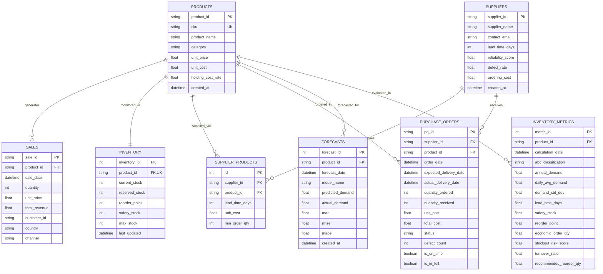

# SupplyChainIQ: Supply Chain Planning & Inventory Optimization Platform

**SupplyChainIQ** is an end-to-end Supply Chain Analytics, Demand Forecasting, and Multi-Echelon Inventory Optimization platform designed for retail and FMCG enterprises.

---

## 🗺️ Project Roadmap & Architecture

```mermaid
flowchart TD
    subgraph Phase 1: Data Engineering & Ingestion
        A[Raw Sales CSV / Public Dataset] --> B[Schema Validator]
        B --> C[Data Cleaning & Outlier Treatment]
        C --> D[Synthetic Supply Chain Enricher]
        D --> E[(PostgreSQL / SQLite Database)]
    end

    subgraph Phase 2: Demand Forecasting
        E --> F[Train/Test Time-Split]
        F --> G[Moving Average & Exp Smoothing]
        G --> H[Model Evaluation: MAE, RMSE, MAPE]
        H --> E
    end

    subgraph Phase 3: Inventory Math & Policies
        E --> I[Safety Stock: SS = Z * σ_d * √L]
        I --> J[Reorder Point: ROP = d_avg * L + SS]
        J --> K[Economic Order Quantity: EOQ = √(2DS/H)]
        K --> E
    end

    subgraph Phase 4: ABC Analysis & Replenishment
        E --> L[Pareto ABC Classification: 80/15/5]
        L --> M[Stockout Risk & Stock Days Index]
        M --> N[Replenishment Orders Generator]
        N --> E
    end

    subgraph Phase 5: Supplier Performance Scorecard
        E --> O[OTIF 40% + Lead Time 30% + Quality 20% + Cost 10%]
        O --> P[Supplier Ranking & Risk Profiling]
        P --> E
    end

    subgraph Phase 6: Analytics & Dashboard Layer
        E --> Q[Power BI Dashboard / FastAPI + React UI]
    end
```

---

## 📊 1. Recommended Public Datasets

For real-world retail and FMCG demand data, use any of the following standard datasets:

1. **UCI Machine Learning Repository: Online Retail II Data Set (Recommended Primary)**
   - *Source*: [UCI Machine Learning Repository](https://archive.ics.uci.edu/dataset/502/online+retail+ii) or Kaggle.
   - *Size*: ~1,000,000 transactions across 2 years (2009–2011).
   - *Fields*: `Invoice`, `StockCode`, `Description`, `Quantity`, `InvoiceDate`, `Price`, `Customer ID`, `Country`.
   - *Why it's great*: Real UK retail gift store transactions containing returns (`C...`), promotional price shifts, and seasonal spikes.

2. **Kaggle: Store Item Demand Forecasting / Retail Sales**
   - 5 years of daily store-item level sales across 10 stores and 50 items. Ideal for evaluating time-series forecasting.

3. **Superstore Sales Dataset**
   - Covers multiple FMCG/retail categories (Office Supplies, Furniture, Technology), shipping modes, and regional orders.

> 💡 **Built-In Sample Generator**: If you don't have a dataset downloaded yet, the pipeline will automatically generate a realistic raw transaction dataset at `sample_data/raw_retail_sales.csv` mimicking real-world noise, returns, missing values, and date format variations.

---

## 🗄️ 2. PostgreSQL Relational Schema (8 Tables)



---

## ⚙️ 3. Data Pipeline Implementation (Phase 1)

The pipeline performs 5 automated stages:
1. **Schema Validation & Alias Mapping** ([`schema_validation.py`](file:///c:/Users/verma/suppy-chain-iq/data_pipeline/schema_validation.py)):
   - Identifies and standardizes flexible column naming (`InvoiceNo` / `StockCode` / `Description` / `InvoiceDate` / `UnitPrice`).
2. **Data Cleaning & Outlier Treatment** ([`cleaner.py`](file:///c:/Users/verma/suppy-chain-iq/data_pipeline/cleaner.py)):
   - Normalizes text, strips whitespace, converts all date formats to ISO UTC datetime.
   - Handles missing descriptions (mode imputation by SKU) and missing customer IDs (`CUST-GUEST`).
   - Filters out cancellation / return transactions (`C...` or `qty <= 0`) for baseline demand modeling.
   - Cleans zero/negative unit prices and applies IQR outlier bounding ($Q3 + 3 \times IQR$) to eliminate extreme data entry typos without squashing genuine demand peaks.
3. **Synthetic Supply Chain Enrichment** ([`synthetic_enricher.py`](file:///c:/Users/verma/suppy-chain-iq/data_pipeline/synthetic_enricher.py)):
   - Derives realistic unit costs ($30\% - 45\%$ gross margin) and holding cost rates ($20\%$ annual).
   - Generates suppliers with realistic lead times (5–21 days), defect rates ($0.5\% - 3\%$), and ordering costs.
   - Generates multi-supplier product sourcing mappings with MOQ constraints.
   - Simulates historical purchase orders (PO ledger) with lead time variances, delays, defect rates, and OTIF (On-Time & In-Full) tracking.
4. **Relational Database Ingestion** ([`ingest.py`](file:///c:/Users/verma/suppy-chain-iq/data_pipeline/ingest.py)):
   - Uses SQLAlchemy 2.0 ORM to create all tables with indexes and foreign key constraints.
   - Batches records atomically into PostgreSQL (with SQLite zero-config fallback for rapid local demos).

---

## 🚀 4. How to Run Phase 1

### Setup & Installation
```bash
# 1. Install dependencies
pip install -r requirements.txt

# 2. Configure PostgreSQL in .env (or leave default to use local SQLite)
cp .env.example .env
```

### Run Phase 1 (Ingestion & Schema Setup)
```bash
python run_phase1.py
```

### Run Phase 2 (Demand Forecasting Engine)
```bash
python run_phase2.py --test-days 30 --horizon 30
```

### Run Phase 3 (Multi-Echelon Inventory Optimization & EOQ)
```bash
python run_phase3.py --service-level 0.95
```

### Run Phase 4 (ABC Analysis, Stockout Risk & Replenishment Recommendations)
```bash
python run_phase4.py
```

### Run Phase 5 (Supplier Performance Scorecard & Risk Profiling)
```bash
python run_phase5.py
```

### Run Phase 6 (Interactive Web Dashboard & FastAPI Platform)
```bash
python run_dashboard.py
```
- **Web Dashboard**: [http://localhost:8000](http://localhost:8000)
- **Interactive Swagger API Docs**: [http://localhost:8000/docs](http://localhost:8000/docs)

### Run All Unit & Integration Tests (30 Tests Passing)
```bash
python -m unittest discover -s tests
```

---

## 💬 Interview Talking Points for Phase 1

- **Handling Dirty Real-World Data**: Demonstrates practical data engineering by addressing messy timestamps, missing keys, cancellations, and extreme data entry anomalies.
- **Relational Integrity**: Enforces foreign key constraints between products, suppliers, inventory levels, sales, and purchase order fulfillment.
- **Supply Chain Math Readiness**: Structures product holding costs, supplier ordering costs ($S$), and lead times ($L$) so downstream phases (Phase 2 forecasting, Phase 3 EOQ/ROP, Phase 4 ABC, Phase 5 Supplier Scoring) operate on clean database relations.
